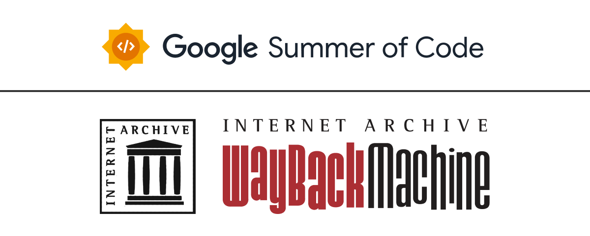

# Athena: Archive Temporal History Exploration and Navigation Assistant

Athena is a Streamlit-based application designed to assist users in exploring and analyzing historical web archive data. The app utilizes advanced AI models to analyze trends, generate insights, and provide users with actionable suggestions. With a focus on temporal history and web page health, Athena offers a robust platform for understanding the evolution and resilience of web content over time.

## Features

- **AI-Powered Chat**: Athena uses OpenAI's models to interact with users, answering queries and providing insights into web archive data.
- **Trend Analysis**: Analyze trends in web archives, including webpage health, content stability, and availability over time.
- **Interactive Visualizations**: View trends and metrics via interactive charts and graphs displayed directly in the app.
- **Function Execution**: Athena can execute functions like fetching CDX data, retrieving historical snapshots, and performing trend analysis based on user queries.

## Project Structure

```plaintext
Athena/
│
├── assets/
│   └── favicon.ico               # Icon used in the app
├── config/
│   ├── function_schemas.py       # Function schemas for validating inputs
│   ├── openai_config.py          # Configuration for OpenAI API
│   ├── router_schemas.py         # Schemas for routing and intent handling
│   └── suggestions.py            # List of suggestions used in the app
│
├── services/
│   ├── openai_service.py         # Service handling communication with OpenAI API
│   ├── semantic_router_service.py # Service for determining intent from user input
│   └── wayback_service.py        # Service for fetching and analyzing data from Wayback Machine
│
├── utils/
│   ├── cdxdata.py                # Utility for handling CDX data
│   ├── extract_text.py           # Utility for extracting text from web archives
│   ├── fetch_data_wayback.py     # Utility for fetching data from Wayback Machine
│   ├── loadcdx.py                # Utility for loading CDX data
│   ├── snapinfo.py               # Utility for handling snapshot information
│   └── trend_analysis.py         # Core utility for analyzing trends in web archives
│
├── .env                          # Environment variables, including OPENAI_API_KEY
├── main.py                       # Main application file
├── requirements.txt              # Python dependencies for the project
└── README.md                     # This file
```

## Setup and Installation

### Prerequisites

- Python 3.7 or higher
- pip (Python package installer)
- An OpenAI API Key

### Installation Steps

1. **Clone the repository**:
    ```bash
    git clone https://github.com/internetarchive/wbm_ai_sum.git
    cd wbm_ai_sum
    ```

2. **Install dependencies**:
    ```bash
    pip install -r requirements.txt
    ```

3. **Set up environment variables**:
    - Create a `.env` file in the root directory with the following content:
      ```plaintext
      OPENAI_API_KEY=your-openai-api-key
      SYSTEM_PROMPT="Already defined system prompt"
      ```
    - Replace `your-openai-api-key` with your actual OpenAI API key.

4. **Run the app**:
    ```bash
    streamlit run main.py
    ```

### Optional: Running with Docker

To run the app using Docker, you can use the following commands:

1. **Build the Docker image**:
    ```bash
    docker build -t athena-app .
    ```

2. **Run the Docker container**:
    ```bash
    docker run -p 8501:8501 athena-app
    ```

## Usage

### Main Interface

- The app provides an interactive chat interface where you can type queries and interact with Athena. 
- The sidebar includes suggestions that can help guide your queries.

### Trend Analysis

- The app analyzes trends in web archives, offering visualizations for **Webpage Health**, **Content Stability**, and **Availability**.
- These trends are displayed in both the main content area and the sidebar.

### Function Execution

- Athena is capable of executing several functions based on your queries:
  - **fetch_cdx_data**: Fetches CDX data for a specified URL.
  - **fetch_data_wayback**: Retrieves data for a specified URL and timestamp.
  - **get_trend_analysis**: Analyzes and visualizes trends for a specified URL.

## Contributing

Contributions are welcome! Please fork the repository and create a pull request to contribute.

### Reporting Issues

If you encounter any issues or have suggestions for new features, please report them on the [issue tracker](https://github.com/internetarchive/wbm_ai_sum/issues).

## License
See the [LICENSE](LICENSE) file for details.

## Acknowledgments

- [OpenAI](https://www.openai.com/) for providing the AI models.
- [Wayback Machine](https://archive.org/web/) for providing web archive data.
